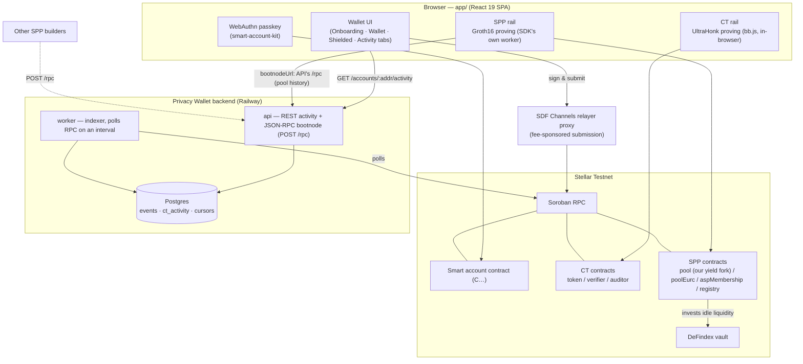

# Privacy Wallet

**A passkey-secured smart wallet for Stellar with two real privacy rails —
confidential transfers and a shielded pool — where the pool's idle liquidity
earns yield in DeFindex.** No seed phrase, no browser extension, real
zero-knowledge proofs generated client-side.

**Try it live (testnet):** https://app-production-2f5e.up.railway.app

Built for the Stellar Privacy hackathon on top of OpenZeppelin's
`smart-account-kit` and Nethermind's `stellar-private-payments` — and where
those stopped short, we forked: a **modified SPP SDK** so the smart account
itself is the shielded signer, a **modified pool contract** that invests idle
deposits into a [DeFindex](https://defindex.io) vault (the yield funds the
service), and **our own indexer + bootnode**, currently the only live SPP
bootnode serving this pool's history anywhere.

## What we built

- **Passkey smart account.** Onboard with Face ID / fingerprint — a
  WebAuthn-secured Soroban smart account (`C…` address) with fee-sponsored
  submission through a relayer. Nothing to back up for day-to-day use.
- **Confidential Transfers (CT).** Register a shielded balance, deposit,
  send, and withdraw with amounts encrypted on-chain. UltraHonk proofs via
  `@aztec/bb.js`, proven entirely in the browser; the wallet decrypts its own
  activity.
- **Shielded pool (SPP).** Shield XLM into a pool, send privately between
  participants, unshield back out. Only the shield/unshield boundary events
  are public — everything inside the pool, including who sent what to whom,
  stays hidden.
- **Smart account as the shielded signer (our SDK fork).** Stock SPP SDK
  only supports classic ed25519 `G…` accounts, forcing a throwaway "session
  account" funded by friendbot. We forked it so the wallet's own `C…`
  address shields, receives, and unshields directly — passkey-authorized,
  friendbot-free. Details below.
- **Yield-bearing shielded pool (our contract fork).** Deposits sitting idle
  in the pool batch-invest into a DeFindex vault. A balance-sheet invariant
  guarantees the admin can only ever skim the *surplus above what's owed to
  depositors* — that surplus is the service fee. Live pool stats (liabilities,
  idle, invested, accrued yield) are shown right in the app's Shielded tab.
- **Our own indexer + bootnode.** The pool's history predates the public
  RPC's retention window and Nethermind's public bootnode rejects every
  request (`-32602`, verified live) — so without our infrastructure the pool
  cannot be synced *at all*. We recovered the full history from
  stellar.expert's archive and serve it, kept current by our own indexer,
  over the standard bootnode protocol. Other builders can use it — see
  [Bootnode usage](#bootnode-usage-for-other-builders).
- **A real compliance story.** CT ciphertexts carry an auditor-decryptable
  component (ops-held key, demonstrable without either party's cooperation),
  and SPP participation is gated by the pool's Association Set Provider. See
  [Compliance](#compliance-story-auditor-decrypt).

## Deployed (testnet)

| Service | URL |
|---|---|
| Wallet app | https://app-production-2f5e.up.railway.app |
| API (REST + bootnode) | https://api-production-70a0.up.railway.app |

`GET /health` on the API returns the indexer's current synced ledger.

## Architecture



## The three forks

Everything below exists because the off-the-shelf stack couldn't do what the
product needed. Each fork is small, auditable, and documented.

### 1. SDK fork — the smart account *is* the shielded signer

The stock SPP SDK is ed25519-native end to end: it parses the user address
as an ed25519 key, signs auth entries as ed25519 signature maps, needs a
classic `G…` source account with a sequence number, and derives the privacy
keys from an ed25519 signature. A passkey (WebAuthn/secp256r1) can satisfy
none of that — so every SPP wallet built on the stock SDK needs a separate
"session account", created and funded by friendbot on testnet.

But the *contracts* don't care: the pool's `transact` accepts any
`sender: Address` with `require_auth()`, and withdrawals pay out to any
address. The limitation was purely client-side. So we forked the SDK
(vendored at `vendor/stellar-private-payments`; the change is a single
116-line commit on top of the pristine upstream tree, adding a
`txSource`/identity split and an `executeTransaction` signer seam), and now:

- Shield pulls straight from the smart account's public XLM, authorized by
  the same passkey-signed Soroban auth entries the CT rail already uses.
- Unshield pays straight back to the smart account.
- Shielded recipients are addressed by wallet `C…` address.
- Friendbot is out of the flow entirely; privacy keys derive from
  deterministic bytes in the wallet's encrypted backup.

Verified live on testnet (wallet `CCLBXDQJ…MGTPT3`): register
[`d917470b…`](https://stellar.expert/explorer/testnet/tx/d917470bfbfbfa7a12dd17246523633e330b930196b2f5a4ad2b1103ac9ea76d),
shield [`352efbca…`](https://stellar.expert/explorer/testnet/tx/352efbca9657ea08c9a180f90d0ae841b6faf9971c3b53e0da193d2d58332b3b),
unshield [`e5e2a26a…`](https://stellar.expert/explorer/testnet/tx/e5e2a26a6d9184fbce8c6a8b0a966c8aaf260920fe6e6ac9e8af7bdc3b9e5d8b),
shielded send [`b443e940…`](https://stellar.expert/explorer/testnet/tx/b443e9406f34170e0ac300ccec82cf4a3bcf215b7f42ccbf27d7d2f78ff49ce9)
— public balance 10,000 → 9,997 XLM exactly, pool balance 3 XLM across 2
notes. For teams on the stock SDK, the no-fork mainnet path (CAP-33
sponsored reserves instead of friendbot) is written up in
`docs/modules/app.md`.

### 2. Contract fork — the shielded pool earns yield

Idle liquidity in a privacy pool earns nothing. Our pool fork
(`contracts/pool-yield/`, deep dive: `docs/modules/pool-yield.md`) changes
that: once idle deposits cross a threshold (1,000 XLM), they batch-invest
into a DeFindex vault, keeping a liquidity buffer (200 XLM) for
withdrawals. Withdrawals that exceed idle liquidity divest from the vault
in the same transaction. The ZK surface is byte-identical to upstream —
no circuit, proof, or event changes.

**The balance-sheet invariant.** The contract tracks a liability counter —
the sum of every deposit minus every withdrawal, i.e. exactly what it owes
note holders. Surplus is `(idle + vault position) − liabilities`, clamped
at zero, and that is the *only* number `collect_yield` can pay out. This is
arithmetic, not policy: note-backed funds are structurally excluded from
ever being skimmed, no matter how or how often the admin calls it. That
surplus is the service fee funding continued development.

Verified end to end on testnet:

- Shield 600 XLM ×2 — the second crosses the threshold and triggers a
  batched 1,000 XLM invest into DeFindex:
  [`544f08b8…`](https://stellar.expert/explorer/testnet/tx/544f08b81018e8b88fdd6f6712d4540cabde873c8595c79027436c4e9afb67d7),
  [`6ecb31c8…`](https://stellar.expert/explorer/testnet/tx/6ecb31c8023c4b8c254a990e98bff856d81522191cdfa26a1f0dfc798fa15ebb)
- Unshield 900 XLM, divesting from the vault in the same transaction:
  [`959ad5e5…`](https://stellar.expert/explorer/testnet/tx/959ad5e53cfc7395588034b093fbec77e1f6e7014d6f2d426125013af7aa8cdc)
- Harvest the vault's strategy, then `collect_yield` pays the surplus
  (17,131 stroops — the demo ran minutes after deployment; the mechanism,
  not the amount, is the point) to the admin, verified via transfer event:
  [`ef1246eb…`](https://stellar.expert/explorer/testnet/tx/ef1246eb4d6cd017a0fb419f022478dd137afceca524e07bfa08639b1bb7bd92),
  [`8b24ecf3…`](https://stellar.expert/explorer/testnet/tx/8b24ecf3cb9dad2ec97a5aae71fc487b7a6761e7522e52a5e5523f87f7ab6be0)

The app's Shielded tab shows the pool's public figures live — owed to
depositors, accrued yield, idle liquidity, amount earning in DeFindex —
read straight from chain via simulation.

### 3. Infrastructure — the only working bootnode for this pool

Both rails hit the same wall: event history older than the public RPC's
retention window is simply gone from public infrastructure.

- **SPP**: the SDK falls back to a bootnode for historical sync, but
  Nethermind's public bootnode rejects every request with `-32602
  unsupported filters` (verified live — see `docs/modules/api.md`). Without
  a working bootnode an SPP client cannot sync the pool **at all**. We
  recovered the pool's full history from stellar.expert's public archive
  (`api/scripts/backfill-spp.ts`, 621 events across 5 contracts), keep it
  current with our own indexer worker, and serve it over the standard
  bootnode protocol at `POST /rpc`.
- **CT**: our REST API (`GET /accounts/:address/activity`) serves normalized
  confidential-token activity from Postgres, so the wallet's activity feed
  works past the RPC retention window too.

## Honest notes (what this is *not*)

- **Batching is not extra privacy.** The invest step pools deposits into one
  vault call for gas and liquidity management. Every SPP deposit's amount is
  already public in its transaction; batching the investment timing reveals
  nothing new — and hides nothing new. The privacy comes from the shielded
  set, as designed.
- **No per-user yield, on purpose.** A note's value is sealed inside a
  commitment — the contract cannot know whose principal a slice of surplus
  "belongs" to, so yield is a pool-level aggregate collected as one lump
  sum. Real per-user attribution needs new circuits (e.g.
  fixed-denomination notes, discussed in design review, not built). Known
  gap, not a bug.
- **The legacy pool stays live.** Nethermind's original (non-yield) pool
  remains indexed at `CAWCZ6EO…BX6XI` purely so pre-fork notes stay
  visible and spendable; new deposits go to the yield fork.
- **Testnet artifacts.** Deposits are capped at 1,000 XLM, and the DeFindex
  vault runs a fixed-APR demo strategy whose yield realizes on a
  permissionless `harvest()` call.

## Contract addresses (testnet)

Confidential Token suite (`contracts/deployments/testnet.json`, deployed at
ledger 3,900,251):

| Contract | Address |
|---|---|
| Token | `CBTEJFLW25UXIDAIWJ3KUJGI5CE2YLHM5GQM2VFU7JQZS53HE3HKGCLH` |
| Verifier | `CBDQQ75BKSAO2TG4D37PKVJZ64F4Y3AHKTSY3NXV6DPEACSDWO4TBGQH` |
| Auditor | `CB27W7M4PLVGC77X5LPNZEOX5UCUWYJ3CODSBR6JR2WJEO66E4BGBDKA` |
| Underlying asset (native XLM SAC) | `CDLZFC3SYJYDZT7K67VZ75HPJVIEUVNIXF47ZG2FB2RMQQVU2HHGCYSC` |

Selective Privacy Pool (`packages/shared/src/config.ts`'s `TESTNET.spp`; the
ASP membership, registry, and EURC pool are a shared testnet deployment we
don't control — the native-XLM pool is **our own** yield-bearing fork,
deployed at ledger 3,968,245, full record in
`contracts/deployments/pool-yield-testnet.json`):

| Contract | Address |
|---|---|
| Pool (native XLM, our yield fork) | `CC3AVJZR5MSOLLNNP7DYSG3KR7MTBE4N4VMAT5ZX4NWIJTQL75RNI3F5` |
| Pool (native XLM, legacy — pre-fork notes only) | `CAWCZ6EO4PM5EZOH5K7XSW3R46DGLOT3XSEH36OA5EOZUSJ5XS7BX6XI` |
| Pool (EURC) | `CAJJT5YV4BMFTHEOO5FGO2G56TEJKM4G4FW7FS4DYBLLLLHSAYUZWT74` |
| Public key registry | `CDK75EQA2G4EDN34CWY7ALJ4EIQMNVBOFMHAVIF3BBY7IUDNHKHNDA36` |
| ASP membership | `CDEFDJPNVWDWUUHGHGGZ56FEPSSJHQLGRKS6OWIRKGRYRWSBNMLW7J5K` |
| DeFindex vault (idle liquidity invests here) | `CAGNH456FTTMWEL26K7CGNVQABPB3SA5AV2YXU4R3XKUODEVU65ZN7Q7` |

## Bootnode usage (for other builders)

If you're building an SPP client against this same testnet pool deployment
and need historical event sync, point your client at our bootnode instead of
standing up your own indexer:

```
https://api-production-70a0.up.railway.app/rpc
```

It speaks the same JSON-RPC 2.0 bootnode protocol the SPP SDK expects
(`getLatestLedger`, `getEvents`) — with the official
`stellar-private-payments` JS SDK, pass it as `bootnodeUrl`:

```ts
import { Client } from "stellar-private-payments";

const client = await Client.new({
  rpcUrl: "https://soroban-testnet.stellar.org",
  storage /* ... */,
  proverWorkerUrl /* ... */,
  bootnodeUrl: "https://api-production-70a0.up.railway.app/rpc",
});
```

**Constraints, so you don't hit a confusing error:**

- **`getEvents` only accepts one exact filter set** — a single `contract`
  filter with `topics: [["**"]]` and `contractIds` set-equal (order doesn't
  matter) to this deployment's full 5-contract sync set:
  `CC3AVJZR5MSOLLNNP7DYSG3KR7MTBE4N4VMAT5ZX4NWIJTQL75RNI3F5` (pool, yield fork),
  `CAWCZ6EO4PM5EZOH5K7XSW3R46DGLOT3XSEH36OA5EOZUSJ5XS7BX6XI` (legacy pool),
  `CAJJT5YV4BMFTHEOO5FGO2G56TEJKM4G4FW7FS4DYBLLLLHSAYUZWT74` (poolEurc),
  `CDEFDJPNVWDWUUHGHGGZ56FEPSSJHQLGRKS6OWIRKGRYRWSBNMLW7J5K` (aspMembership),
  `CDK75EQA2G4EDN34CWY7ALJ4EIQMNVBOFMHAVIF3BBY7IUDNHKHNDA36` (publicKeyRegistry).
  Any other filter set returns `-32602 unsupported filters` — this is not a
  general-purpose bootnode; it serves exactly this pool deployment's
  contract set (verified live as of 2026-08-04: the 5-contract set returns
  events, anything else is rejected).
- Provide exactly one of `startLedger` or `pagination.cursor`, never both.
- Once you page past our indexed tip, `getEvents` returns `-32002` (a
  retention-handoff response with `fromLedger`) — that's the SDK's own
  signal to resume on the main RPC, not an error to work around.

Full protocol details (validation order, error codes, where our semantics
deliberately diverge from the reference bootnode): `docs/modules/api.md`.

## Compliance story (auditor decrypt)

The CT contracts are deployed with an on-chain auditor public key; every
confidential transfer's ciphertext includes an auditor-decryptable component
alongside the sender/recipient one. The auditor's private key is held
ops-side (never committed), and `@ctd/sdk`'s `src/auditor/` module can
decrypt any transfer's amount with it, independent of either party's
cooperation — script-demonstrable via `packages/ctd-sdk/test/auditor.mjs`.

On the SPP side, pool participants must be approved by the Association Set
Provider before shielded transactions go through — an off-chain compliance
gate the wallet surfaces when it applies. Both rails pair privacy with a
real compliance story, not privacy at the expense of one.

## Run it locally

Requirements: Node ≥ 22, pnpm ≥ 10, Docker (for local Postgres).

```bash
pnpm install

# 1. Database
docker compose up -d postgres                              # postgres:16-alpine on localhost:5433
cp .env.example .env                                       # DATABASE_URL defaults match docker-compose.yml
pnpm --filter @privacy-wallet/api run db:migrate           # schema
pnpm --filter @privacy-wallet/api run backfill:spp:load    # loads the pool's recovered history (621 events) — REQUIRED

# 2. API + worker
pnpm --filter @privacy-wallet/api dev      # REST + bootnode server, http://localhost:3000
pnpm --filter @privacy-wallet/api worker   # indexer worker (separate process, same DB)

# 3. App
cp app/.env.example app/.env               # VITE_API_URL defaults to http://localhost:3000
pnpm --filter app dev                      # http://localhost:5173
```

The backfill step is required — without it the SPP rail has no history to
sync from. Both DB commands are idempotent. The app needs the API running
(activity feed + the Shielded tab's pool-history source), so start it after
step 2.

```bash
pnpm build   # builds packages/shared, packages/ctd-sdk, api, app
pnpm test    # runs every workspace's test suite
```

## Monorepo layout

```
app/                # React 19 + Vite wallet SPA — passkey onboarding, CT rail, SPP rail, Activity view
api/                # @privacy-wallet/api — Postgres-backed indexer worker + REST/bootnode HTTP server
packages/shared/    # @privacy-wallet/shared — TESTNET network/contract config, shared CT invoke glue
packages/ctd-sdk/   # @ctd/sdk — vendored Confidential Token client SDK (witness/proving/chain/state)
contracts/          # pool-yield contract fork + CT deployment records + deploy procedures
vendor/             # stellar-private-payments — vendored SPP SDK with our C-address signer fork
railway/            # Config-as-code for the three Railway services (api/worker/app)
docs/modules/       # Living per-module documentation (read before touching a module)
scripts/            # Root-level scripts (smoke-ct.ts — smart-account/CT lifecycle smoke test)
```

## Testing

- `app`: 143 tests, plus `typecheck` and `build`, all green.
- `api`: 173 tests (needs `DATABASE_URL` against a running Postgres for the
  full count — DB-integration cases auto-skip otherwise), `build` green.
- `packages/shared`: 7 tests, `build` green.
- `contracts/pool-yield`: 37 unit tests (`cargo test`) covering the invest /
  divest / surplus invariants, authorization failures, and error paths.
- `packages/ctd-sdk`: `parity.mjs` (7 cases) and `prove.mjs` (3 real
  UltraHonk proofs) pass; the vendored suite's `disclosure.mjs` fails on a
  pre-existing upstream gap (a sibling `@ctd/disclosure` package was never
  vendored) — documented in `docs/modules/ctd-sdk.md`, unrelated to our
  changes.

See `docs/modules/README.md` for the per-module documentation index — every
module has a living doc with file maps, `file:line` references, and the
gotchas that took real debugging time to learn.

## Attribution

- **`packages/ctd-sdk/`** (`@ctd/sdk`) is vendored from
  [`brozorec/stellar-confidential-token-demo`](https://github.com/brozorec/stellar-confidential-token-demo)
  (commit `ac67499a617c084b80c0e0298180b2c4faf9e2fb`, `packages/sdk`), MIT
  licensed. Provenance and local modifications: `packages/ctd-sdk/ATTRIBUTION.md`.
- **`vendor/stellar-private-payments`** is vendored from
  [NethermindEth/stellar-private-payments](https://github.com/NethermindEth/stellar-private-payments);
  our C-address signer fork is the single commit on top of the pristine
  upstream tree. `contracts/pool-yield/` is our fork of its pool contract.
- **Passkey smart accounts** via `smart-account-kit` (OpenZeppelin), with
  fee-sponsored submission through SDF's public Channels relayer proxy.

## License

No license file is published in this repository — this is a hackathon
submission, not a released package. Vendored code retains its upstream
licenses (see the attribution links above).
